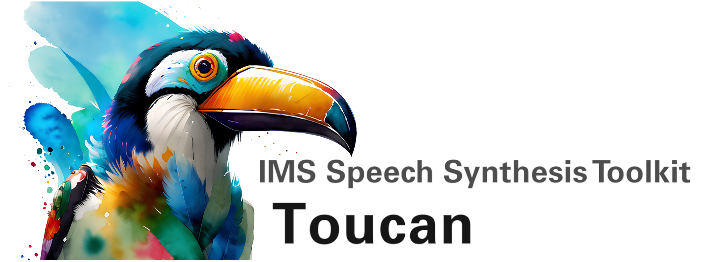

IMS Toucan is a toolkit for teaching, training and using state-of-the-art Speech Synthesis models, developed at the
**Institute for Natural Language Processing (IMS), University of Stuttgart, Germany**. Everything is pure Python and
PyTorch based to keep it as simple and beginner-friendly, yet powerful as possible.

---

## Links 🦚

### Pre-Generated Audios

[Human-in-the-loop edited poetry for German literary studies](https://poetictts.github.io/)

[Cloning prosody across speakers](https://toucanprosodycloningdemo.github.io)

[Multi-lingual and multi-speaker audios](https://multilingualtoucan.github.io/)

[Massively-Multi-Lingual audios and study setup](https://anondemos.github.io/MMDemo)

### Interactive Demos

[Check out our massively-multi-lingual demo on Huggingface🤗](https://huggingface.co/spaces/Flux9665/MassivelyMultilingualTTS)

[Check out our demo on exact style cloning on Huggingface🤗](https://huggingface.co/spaces/Flux9665/SpeechCloning)

[Check out our human-in-the-loop poetry reading demo on Huggingface🤗](https://huggingface.co/spaces/Flux9665/PoeticTTS)

[You can also design the voice of a speaker who doesn't exist on Huggingface🤗](https://huggingface.co/spaces/Flux9665/ThisSpeakerDoesNotExist)

### Dataset

[We have also published a massively multilingual TTS dataset on Huggingface🤗](https://huggingface.co/datasets/Flux9665/BibleMMS)

---

## Installation 🦉

These instructions should work for most cases, but I heard of some instances where espeak behaves weird, which are
sometimes resolved after a re-install and sometimes not. Also, M1 and M2 MacBooks require a very different installation
process, with which I am unfortunately not familiar.

#### Basic Requirements

To install this toolkit, clone it onto the machine you want to use it on
(should have at least one cuda enabled GPU if you intend to train models on that machine. For inference, you don't need
a GPU).

If you're using Linux, you should have the following packages installed, or install them with apt-get if you haven't (on
most distributions they come pre-installed):

```
libsndfile1
espeak-ng
ffmpeg
libasound-dev
libportaudio2
libsqlite3-dev
```

Navigate to the directory you have cloned. We recommend creating and activating a
[virtual environment](https://docs.python.org/3/library/venv.html)
to install the basic requirements into. The commands below summarize everything you need to do under Linux. If you are
running Windows, the second line needs to be changed, please have a look at
the [venv documentation](https://docs.python.org/3/library/venv.html).

```
python -m venv <path_to_where_you_want_your_env_to_be>

source <path_to_where_you_want_your_env_to_be>/bin/activate

pip install --no-cache-dir -r requirements.txt
```

Run the second line everytime you start using the tool again to activate the virtual environment again, if you e.g.
logged out in the meantime. To make use of a GPU, you don't need to do anything else on a Linux machine. On a Windows
machine, have a look at [the official PyTorch website](https://pytorch.org/) for the install-command that enables GPU
support.

#### Storage configuration

If you don't want the pretrained and trained models as well as the cache files resulting from preprocessing your
datasets to be stored in the default subfolders, you can set corresponding directories globally by
editing `Utility/storage_config.py` to suit your needs (the path can be relative to the repository root directory or
absolute).

#### Pretrained Models

You don't need to use pretrained models, but it can speed things up tremendously. Run the `run_model_downloader.py`
script to automatically download them from the release page and put them into their appropriate locations with
appropriate names.

#### \[optional] eSpeak-NG

eSpeak-NG is an optional requirement, that handles lots of special cases in many languages, so it's good to have.

On most **Linux** environments it will be installed already, and if it is not, and you have the sufficient rights, you
can install it by simply running

```
apt-get install espeak-ng
```

For **Windows**, they provide a convenient .msi installer file
[on their GitHub release page](https://github.com/espeak-ng/espeak-ng/releases). After installation on non-linux
systems, you'll also need to tell the phonemizer library where to find your espeak installation by setting the
`PHONEMIZER_ESPEAK_LIBRARY` environment variable, which is discussed in
[this issue](https://github.com/bootphon/phonemizer/issues/44#issuecomment-1008449718).

For **Mac** it's unfortunately a lot more complicated. Thanks to Sang Hyun Park, here is a guide for installing it on
Mac:
For M1 Macs, the most convenient method to install espeak-ng onto your system is via a
[MacPorts port of espeak-ng](https://ports.macports.org/port/espeak-ng/). MacPorts itself can be installed from the
[MacPorts website](https://www.macports.org/install.php), which also requires Apple's
[XCode](https://developer.apple.com/xcode/). Once XCode and MacPorts have been installed, you can install the port of
espeak-ng via

```
sudo port install espeak-ng
```

As stated in the Windows install instructions, the espeak-ng installation will need to be set as a variable for the
phonemizer library. The environment variable is `PHONEMIZER_ESPEAK_LIBRARY` as given in the
[GitHub thread](https://github.com/bootphon/phonemizer/issues/44#issuecomment-1008449718) linked above.
However, the espeak-ng installation file you need to set this variable to is a .dylib file rather than a .dll file on
Mac. In order to locate the espeak-ng library file, you can run `port contents espeak-ng`. The specific file you are
looking for is named `libespeak-ng.dylib`.

---

## Inference 🦢

You can load your trained models, or the pretrained provided one, using the `InferenceInterfaces/ToucanTTSInterface.py`.
Simply create an object from it with the proper directory handle
identifying the model you want to use. The rest should work out in the background. You might want to set a language
embedding or a speaker embedding using the *set_language* and *set_speaker_embedding* functions. Most things should be
self-explanatory.

An *InferenceInterface* contains two methods to create audio from text. They are
*read_to_file* and
*read_aloud*.

- *read_to_file* takes as input a list of strings and a filename. It will synthesize the sentences in the list and
  concatenate them with a short pause inbetween and write them to the filepath you supply as the other argument.

- *read_aloud* takes just a string, which it will then convert to speech and immediately play using the system's
  speakers. If you set the optional argument
  *view* to
  *True*, a visualization will pop up, that you need to close for the program to continue.

Their use is demonstrated in
*run_interactive_demo.py* and
*run_text_to_file_reader.py*.

There are simple scaling parameters to control the duration, the variance of the pitch curve and the variance of the
energy curve. You can either change them in the code when using the interactive demo or the reader, or you can simply
pass them to the interface when you use it in your own code.

---

## Creating a new Training Pipeline 🐣

In the directory called
*Utility* there is a file called
`path_to_transcript_dicts.py`. In this file you should write a function that returns a dictionary that has all the
absolute paths to each of the audio files in your dataset as strings as the keys and the textual transcriptions of the
corresponding audios as the values.

Then go to the directory
*TrainingInterfaces/TrainingPipelines*. In there, make a copy of the `finetuning_example_simple.py` file if you just want to finetune on a single dataset or `finetuning_example_multilingual.py` if you want to finetune on multiple datasets, potentially even multiple languages. We will use this copy
as reference and only make the necessary changes to use the new dataset. Find the call(s) to the *prepare_tts_corpus* function. Replace the path_to_transcript_dict used there with the one(s) you just created. Then change the name of the corresponding cache directory to something that makes sense for the dataset.
Also look out for the variable *save_dir*, which is where the checkpoints will be saved to. This is a default value, you can overwrite it when calling
the pipeline later using a command line argument, in case you want to fine-tune from a checkpoint and thus save into a
different directory. Finally, change the
*lang* argument in the creation of the dataset and in the call to the train loop function to the ISO 639-3 language ID that
matches your data.

The arguments that are given to the train loop in the finetuning examples are meant for the case of finetuning from a pretrained model. If you want
to train from scratch, have a look at a different pipeline that has ToucanTTS in its name and look at the arguments
used there.

Once this is complete, we are almost done, now we just need to make it available to the
`run_training_pipeline.py` file in the top level. In said file, import the
*run* function from the pipeline you just created and give it a meaningful name. Now in the
*pipeline_dict*, add your imported function as value and use as key a shorthand that makes sense.

---

## Training a Model 🦜

Once you have a training pipeline built, training is super easy:

```
python run_training_pipeline.py <shorthand of the pipeline>
```

You can supply any of the following arguments, but don't have to (although for training you should definitely specify at
least a GPU ID).

```
--gpu_id <ID of the GPU you wish to use, as displayed with nvidia-smi, default is cpu. If multiple GPUs are provided (comma separated), then distributed training will be used, but the script has to be started with torchrun.> 

--resume_checkpoint <path to a checkpoint to load>

--resume (if this is present, the furthest checkpoint available will be loaded automatically)

--finetune (if this is present, the provided checkpoint will be fine-tuned on the data from this pipeline)

--model_save_dir <path to a directory where the checkpoints should be saved>

--wandb (if this is present, the logs will be synchronized to your weights&biases account, if you are logged in on the command line)

--wandb_resume_id <the id of the run you want to resume, if you are using weights&biases (you can find the id in the URL of the run)>
```

For multi-GPU training, you have to supply multiple GPU ids (comma separated) and start the script with torchrun. You also have to specify the number of GPUs. This has to match the number of IDs that you supply. Careful: torchrun is incompatible with nohup! Use tmux instead to keep the script running after you log out of the shell.

```
torchrun --standalone --nproc_per_node=4 --nnodes=1 run_training_pipeline.py <shorthand of the pipeline> --gpu_id "0,1,2,3"
```

After every epoch (or alternatively after certain step counts), some logs will be written to the console and to the Weights and Biases website, if you are logged in and set the flag. If you get cuda out of memory errors, you need to decrease
the batchsize in the arguments of the call to the training_loop in the pipeline you are running. Try decreasing the
batchsize in small steps until you get no more out of cuda memory errors.

In the directory you specified for saving, checkpoint files and spectrogram visualization
data will appear. Since the checkpoints are quite big, only the five most recent ones will be kept. The amount of
training steps highly depends on the data you are using and whether you're finetuning from a pretrained checkpoint or
training from scratch. The fewer data you have, the fewer steps you should take to prevent a possible collapse. If
you want to stop earlier, just kill the process, since everything is daemonic all the child-processes should die with
it. In case there are some ghost-processes left behind, you can use the following command to find them and kill them
manually.

```
fuser -v /dev/nvidia*
```

Whenever a checkpoint is saved, a compressed version that can be used for inference is also created, which is named _best.py_

---

## FAQ 🐓

Here are a few points that were brought up by users:

- How can I figure out if my data has outliers or similar problems? -- There is a scorer that can find and even remove
  samples from your dataset cache that have extraordinarily high loss values, have a look at `run_scorer.py`.
- My error message shows GPU0, even though I specified a different GPU -- The way GPU selection works is that the
  specified GPU is set as the only visible device, in order to avoid backend stuff running accidentally on different
  GPUs. So internally the program will name the device GPU0, because it is the only GPU it can see. It is actually
  running on the GPU you specified.
- read_to_file produces strange outputs -- Check if you're passing a list to the method or a string. Since strings can be
  iterated over, it might not throw an error, but a list of strings is expected.
- `UserWarning: Detected call of lr_scheduler.step() before optimizer.step().` -- We use a custom scheduler, and torch
  incorrectly thinks that we call the scheduler and the optimizer in the wrong order. Just ignore this warning, it is
  completely meaningless.
- `WARNING[XFORMERS]: xFormers can't load C++/CUDA extensions. [...]` -- Another meaningless warning. We actually don't
  use xFormers ourselves, it is just part of the dependencies of one of our dependencies, but it is not used at any place.
- `The torchaudio backend is switched to 'soundfile'. Note that 'sox_io' is not supported on Windows. [...]` -- Just happens under Windows and doesn't affect anything.
- `WARNING:phonemizer:words count mismatch on 200.0% of the lines (2/1) [...]` -- We have no idea why espeak started giving out this warning, however it doesn't seem to affect anything, so it seems safe to ignore.
- Loss turns to `NaN` -- The default learning rates work on clean data. If your data is less clean, try using the scorer
  to find problematic samples, or reduce the learning rate. The most common problem is there being pauses in the speech,
  but nothing that hints at them in the text. That's why ASR corpora, which leave out punctuation, are usually difficult
  to use for TTS.

---

## Disclaimer 🦆

The basic PyTorch modules of FastSpeech 2 and GST are taken from
[ESPnet](https://github.com/espnet/espnet), the PyTorch modules of
HiFi-GAN are taken from the [ParallelWaveGAN repository](https://github.com/kan-bayashi/ParallelWaveGAN).
Some modules related to the ConditionalFlowMatching based PostNet as outlined in MatchaTTS are taken
from the [official MatchaTTS codebase](https://github.com/shivammehta25/Matcha-TTS) and some are taken
from [the StableTTS codebase](https://github.com/KdaiP/StableTTS).
For grapheme-to-phoneme conversion, we rely on the aforementioned eSpeak-NG as
well as [transphone](https://github.com/xinjli/transphone). We
use [encodec, a neural audio codec](https://github.com/yangdongchao/AcademiCodec) as intermediate representation
for caching the train data to save space.

## Citation 🐧

If you find this repo useful, consider giving it a star. Large numbers make me happy, and they are quite motivating :)

<a href="https://star-history.com/#DigitalPhonetics/IMS-Toucan&Date">
 <picture>
   <source media="(prefers-color-scheme: dark)" srcset="https://api.star-history.com/svg?repos=DigitalPhonetics/IMS-Toucan&type=Date&theme=dark" />
   <source media="(prefers-color-scheme: light)" srcset="https://api.star-history.com/svg?repos=DigitalPhonetics/IMS-Toucan&type=Date" />
   
 </picture>
</a>

### Introduction of the Toolkit [[associated code and models]](https://github.com/DigitalPhonetics/IMS-Toucan/releases/tag/v1.0)

```
@inproceedings{lux2021toucan,
  year         = 2021,
  title        = {{The IMS Toucan system for the Blizzard Challenge 2021}},
  author       = {Florian Lux and Julia Koch and Antje Schweitzer and Ngoc Thang Vu},
  booktitle    = {Blizzard Challenge Workshop},
  publisher    = {ISCA Speech Synthesis SIG}
}
```

### Adding Articulatory Features and Meta-Learning Pretraining [[associated code and models]](https://github.com/DigitalPhonetics/IMS-Toucan/releases/tag/v1.1)

```
@inproceedings{lux2022laml,
  year         = 2022,
  title        = {{Language-Agnostic Meta-Learning for Low-Resource Text-to-Speech with Articulatory Features}},
  author       = {Florian Lux and Ngoc Thang Vu},
  booktitle    = {ACL}
}
```

### Adding Exact Prosody-Cloning Capabilities [[associated code and models]](https://github.com/DigitalPhonetics/IMS-Toucan/releases/tag/v2.2)

```
@inproceedings{lux2022cloning,
  year         = 2022,
  title        = {{Exact Prosody Cloning in Zero-Shot Multispeaker Text-to-Speech}},
  author       = {Lux, Florian and Koch, Julia and Vu, Ngoc Thang},
  booktitle    = {SLT},
  publisher    = {IEEE}
}
```

### Adding Language Embeddings and Word Boundaries [[associated code and models]](https://github.com/DigitalPhonetics/IMS-Toucan/releases/tag/v2.2)

```
@inproceedings{lux2022lrms,
  year         = 2022,
  title        = {{Low-Resource Multilingual and Zero-Shot Multispeaker TTS}},
  author       = {Florian Lux and Julia Koch and Ngoc Thang Vu},
  booktitle    = {AACL}
}
```

### Adding Controllable Speaker Embedding Generation [[associated code and models]](https://github.com/DigitalPhonetics/IMS-Toucan/releases/tag/v2.3)

```
@inproceedings{lux2023controllable,
  year         = 2023,
  title        = {{Low-Resource Multilingual and Zero-Shot Multispeaker TTS}},
  author       = {Florian Lux and Pascal Tilli and Sarina Meyer and Ngoc Thang Vu},
  booktitle    = {Interspeech}
  publisher    = {ISCA}
}
```

### Our Contribution to the Blizzard Challenge 2023 [[associated code and models]](https://github.com/DigitalPhonetics/IMS-Toucan/releases/tag/v2.b)

```
@inproceedings{lux2023controllable,
  year         = 2023,
  title        = {{The IMS Toucan System for the Blizzard Challenge 2023}},
  author       = {Florian Lux and Julia Koch and Sarina Meyer and Thomas Bott and Nadja Schauffler and Pavel Denisov and Antje Schweitzer and Ngoc Thang Vu},
  booktitle    = {Blizzard Challenge Workshop},
  publisher    = {ISCA Speech Synthesis SIG}
}
```

### Introducing the first TTS System in over 7000 languages [[associated code and models]](https://github.com/DigitalPhonetics/IMS-Toucan/releases/tag/v3.0)

```
@inproceedings{lux2024massive,
  year         = 2024,
  title        = {{Meta Learning Text-to-Speech Synthesis in over 7000 Languages}},
  author       = {Florian Lux and Sarina Meyer and Lyonel Behringer and Frank Zalkow and Phat Do and Matt Coler and  Emanuël A. P. Habets and Ngoc Thang Vu},
  booktitle    = {Interspeech}
  publisher    = {ISCA}
}
```
