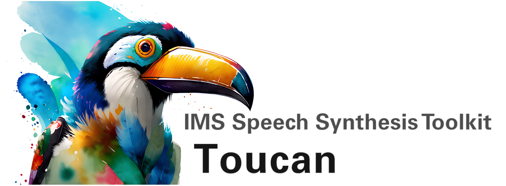

IMS Toucan is a toolkit for teaching, training and using state-of-the-art Speech Synthesis models, developed at the
**Institute for Natural Language Processing (IMS), University of Stuttgart, Germany**. Everything is pure Python and
PyTorch based to keep it as simple and beginner-friendly, yet powerful as possible.

---

## Links 🦚

## Installation 🦉

These instructions should work for most cases, but I heard of some instances where espeak behaves weird, which are
sometimes resolved after a re-install and sometimes not. Also, M1 and M2 MacBooks require a very different installation
process, with which I am unfortunately not familiar.

#### Basic Requirements

To install this toolkit, clone it onto the machine you want to use it on
(should have at least one cuda enabled GPU if you intend to train models on that machine. For inference, you don't need
a GPU).

If you're using Linux, you should have the following packages installed, or install them with apt-get if you haven't (on
most distributions they come pre-installed):

```
libsndfile1
espeak-ng
ffmpeg
libasound-dev
libportaudio2
libsqlite3-dev
```

Navigate to the directory you have cloned. We recommend creating and activating a
[virtual environment](https://docs.python.org/3/library/venv.html)
to install the basic requirements into. The commands below summarize everything you need to do under Linux. If you are
running Windows, the second line needs to be changed, please have a look at
the [venv documentation](https://docs.python.org/3/library/venv.html).

```
python -m venv <path_to_where_you_want_your_env_to_be>

source <path_to_where_you_want_your_env_to_be>/bin/activate

pip install --no-cache-dir -r requirements.txt
```

Run the second line everytime you start using the tool again to activate the virtual environment again, if you e.g.
logged out in the meantime. To make use of a GPU, you don't need to do anything else on a Linux machine. On a Windows
machine, have a look at [the official PyTorch website](https://pytorch.org/) for the install-command that enables GPU
support.

#### Storage configuration

If you don't want the pretrained and trained models as well as the cache files resulting from preprocessing your
datasets to be stored in the default subfolders, you can set corresponding directories globally by
editing `Utility/storage_config.py` to suit your needs (the path can be relative to the repository root directory or
absolute).

#### Pretrained Models

You don't need to use pretrained models, but it can speed things up tremendously. Run the `run_model_downloader.py`
script to automatically download them from the release page and put them into their appropriate locations with
appropriate names.

#### \[optional] eSpeak-NG

eSpeak-NG is an optional requirement, that handles lots of special cases in many languages, so it's good to have.

On most **Linux** environments it will be installed already, and if it is not, and you have the sufficient rights, you
can install it by simply running

```
apt-get install espeak-ng
```

For **Windows**, they provide a convenient .msi installer file
[on their GitHub release page](https://github.com/espeak-ng/espeak-ng/releases). After installation on non-linux
systems, you'll also need to tell the phonemizer library where to find your espeak installation by setting the
`PHONEMIZER_ESPEAK_LIBRARY` environment variable, which is discussed in
[this issue](https://github.com/bootphon/phonemizer/issues/44#issuecomment-1008449718).

For **Mac** it's unfortunately a lot more complicated. Thanks to Sang Hyun Park, here is a guide for installing it on
Mac:
For M1 Macs, the most convenient method to install espeak-ng onto your system is via a
[MacPorts port of espeak-ng](https://ports.macports.org/port/espeak-ng/). MacPorts itself can be installed from the
[MacPorts website](https://www.macports.org/install.php), which also requires Apple's
[XCode](https://developer.apple.com/xcode/). Once XCode and MacPorts have been installed, you can install the port of
espeak-ng via

```
sudo port install espeak-ng
```

As stated in the Windows install instructions, the espeak-ng installation will need to be set as a variable for the
phonemizer library. The environment variable is `PHONEMIZER_ESPEAK_LIBRARY` as given in the
[GitHub thread](https://github.com/bootphon/phonemizer/issues/44#issuecomment-1008449718) linked above.
However, the espeak-ng installation file you need to set this variable to is a .dylib file rather than a .dll file on
Mac. In order to locate the espeak-ng library file, you can run `port contents espeak-ng`. The specific file you are
looking for is named `libespeak-ng.dylib`.

---

## Inference 🦢

You can load your trained models, or the pretrained provided one, using the `InferenceInterfaces/ToucanTTSInterface.py`.
Simply create an object from it with the proper directory handle
identifying the model you want to use. The rest should work out in the background. You might want to set a language
embedding or a speaker embedding using the *set_language* and *set_speaker_embedding* functions. Most things should be
self-explanatory.

An *InferenceInterface* contains two methods to create audio from text. They are
*read_to_file* and
*read_aloud*.

- *read_to_file* takes as input a list of strings and a filename. It will synthesize the sentences in the list and
  concatenate them with a short pause inbetween and write them to the filepath you supply as the other argument.

- *read_aloud* takes just a string, which it will then convert to speech and immediately play using the system's
  speakers. If you set the optional argument
  *view* to
  *True*, a visualization will pop up, that you need to close for the program to continue.


There are simple scaling parameters to control the duration, the variance of the pitch curve and the variance of the
energy curve. You can either change them in the code when using the interactive demo or the reader, or you can simply
pass them to the interface when you use it in your own code.

---


## Training a Model 🦜

```
python run_training_pipeline.py <shorthand of the pipeline>
```

You can supply any of the following arguments, but don't have to (although for training you should definitely specify at
least a GPU ID).

```
--gpu_id <ID of the GPU you wish to use, as displayed with nvidia-smi, default is cpu. If multiple GPUs are provided (comma separated), then distributed training will be used, but the script has to be started with torchrun.> 

--resume_checkpoint <path to a checkpoint to load>

--resume (if this is present, the furthest checkpoint available will be loaded automatically)

--finetune (if this is present, the provided checkpoint will be fine-tuned on the data from this pipeline)

--model_save_dir <path to a directory where the checkpoints should be saved>

--wandb (if this is present, the logs will be synchronized to your weights&biases account, if you are logged in on the command line)

--wandb_resume_id <the id of the run you want to resume, if you are using weights&biases (you can find the id in the URL of the run)>
```

After every epoch (or alternatively after certain step counts), some logs will be written to the console and to the Weights and Biases website, if you are logged in and set the flag. If you get cuda out of memory errors, you need to decrease
the batchsize in the arguments of the call to the training_loop in the pipeline you are running. Try decreasing the
batchsize in small steps until you get no more out of cuda memory errors.

In the directory you specified for saving, checkpoint files and spectrogram visualization
data will appear. Since the checkpoints are quite big, only the five most recent ones will be kept. The amount of
training steps highly depends on the data you are using and whether you're finetuning from a pretrained checkpoint or
training from scratch. The fewer data you have, the fewer steps you should take to prevent a possible collapse. If
you want to stop earlier, just kill the process, since everything is daemonic all the child-processes should die with
it. In case there are some ghost-processes left behind, you can use the following command to find them and kill them
manually.

```
fuser -v /dev/nvidia*
```

Whenever a checkpoint is saved, a compressed version that can be used for inference is also created, which is named _best.py_

### Configuring the Prosody Modeling
You can customize key parameters for the probabilistic prosody model directly in the `ToucanTTS_Prosody.py` file:

```
# Prosody model configuration
order = "ped"  # Order of prosodic features: pitch, energy, duration. Options: "ped", "epd", or "all"
prosody_channels = 8  # Number of channels for the prosody predictor
predictor_layers = 3  # Number of layers in the prosody predictor
predictor_kernel_size = 5  # Kernel size for convolutional layers
predictor_dropout_rate = 0.2  # Dropout rate within the predictor
architecture = "CFM"  # Architecture type: "CFM", "NF", "RF" or "DET"
start_reflow = 91000  # Step count to start reflow; if set higher than current step count, reflow is skipped
dropout = False  # Apply dropout in the model
log = False  # Enable logging within this component
```
Modify these values to experiment with different architectures.

---

## Evaluation 🐤
To run evaluation on a trained model, use the following command:

```
python run_evaluation.py
```
You can supply any of the following arguments to customize the evaluation process:

```
--model_dir <Path to the parent directory of all models to evaluate. This should contain the checkpoints and metadata.>

--version <Identifier for the run, useful for distinguishing between different evaluation sets or experiments.>

--gpu_id <Which GPU(s) to use, e.g. 0 or 0,1. If not specified or set to "cpu", evaluation will run on CPU (which is generally only suitable for quick tests or debugging).>

--wandb (if this is present, the results will be tracked on your Weights & Biases account. Make sure you're logged in with `wandb login` beforehand.)

--multi_speaker (if this is present, evaluation will account for multiple speaker identities — useful if your model was trained with multiple voices.)
```

Typical usage looks like this:

```
python run_eval.py --model_dir ./checkpoints/my_model --version eval_v1 --gpu_id 0 --wandb
```

If --wandb is used, the results will be logged to your Weights & Biases dashboard.


---

## Disclaimer 🦆

The basic PyTorch modules of FastSpeech 2 and GST are taken from
[ESPnet](https://github.com/espnet/espnet), the PyTorch modules of
HiFi-GAN are taken from the [ParallelWaveGAN repository](https://github.com/kan-bayashi/ParallelWaveGAN).
Some modules related to the ConditionalFlowMatching based PostNet as outlined in MatchaTTS are taken
from the [official MatchaTTS codebase](https://github.com/shivammehta25/Matcha-TTS) and some are taken
from [the StableTTS codebase](https://github.com/KdaiP/StableTTS).
For grapheme-to-phoneme conversion, we rely on the aforementioned eSpeak-NG as
well as [transphone](https://github.com/xinjli/transphone). We
use [encodec, a neural audio codec](https://github.com/yangdongchao/AcademiCodec) as intermediate representation
for caching the train data to save space.

## Citation 🐧

If you find this repo useful, consider giving it a star. Large numbers make me happy, and they are quite motivating :)

<a href="https://star-history.com/#DigitalPhonetics/IMS-Toucan&Date">
 <picture>
   <source media="(prefers-color-scheme: dark)" srcset="https://api.star-history.com/svg?repos=DigitalPhonetics/IMS-Toucan&type=Date&theme=dark" />
   <source media="(prefers-color-scheme: light)" srcset="https://api.star-history.com/svg?repos=DigitalPhonetics/IMS-Toucan&type=Date" />
   
 </picture>
</a>

### Introduction of the Toolkit [[associated code and models]](https://github.com/DigitalPhonetics/IMS-Toucan/releases/tag/v1.0)

```
@inproceedings{lux2021toucan,
  year         = 2021,
  title        = {{The IMS Toucan system for the Blizzard Challenge 2021}},
  author       = {Florian Lux and Julia Koch and Antje Schweitzer and Ngoc Thang Vu},
  booktitle    = {Blizzard Challenge Workshop},
  publisher    = {ISCA Speech Synthesis SIG}
}
```

### Adding Articulatory Features and Meta-Learning Pretraining [[associated code and models]](https://github.com/DigitalPhonetics/IMS-Toucan/releases/tag/v1.1)

```
@inproceedings{lux2022laml,
  year         = 2022,
  title        = {{Language-Agnostic Meta-Learning for Low-Resource Text-to-Speech with Articulatory Features}},
  author       = {Florian Lux and Ngoc Thang Vu},
  booktitle    = {ACL}
}
```

### Adding Exact Prosody-Cloning Capabilities [[associated code and models]](https://github.com/DigitalPhonetics/IMS-Toucan/releases/tag/v2.2)

```
@inproceedings{lux2022cloning,
  year         = 2022,
  title        = {{Exact Prosody Cloning in Zero-Shot Multispeaker Text-to-Speech}},
  author       = {Lux, Florian and Koch, Julia and Vu, Ngoc Thang},
  booktitle    = {SLT},
  publisher    = {IEEE}
}
```

### Adding Language Embeddings and Word Boundaries [[associated code and models]](https://github.com/DigitalPhonetics/IMS-Toucan/releases/tag/v2.2)

```
@inproceedings{lux2022lrms,
  year         = 2022,
  title        = {{Low-Resource Multilingual and Zero-Shot Multispeaker TTS}},
  author       = {Florian Lux and Julia Koch and Ngoc Thang Vu},
  booktitle    = {AACL}
}
```

### Adding Controllable Speaker Embedding Generation [[associated code and models]](https://github.com/DigitalPhonetics/IMS-Toucan/releases/tag/v2.3)

```
@inproceedings{lux2023controllable,
  year         = 2023,
  title        = {{Low-Resource Multilingual and Zero-Shot Multispeaker TTS}},
  author       = {Florian Lux and Pascal Tilli and Sarina Meyer and Ngoc Thang Vu},
  booktitle    = {Interspeech}
  publisher    = {ISCA}
}
```

### Our Contribution to the Blizzard Challenge 2023 [[associated code and models]](https://github.com/DigitalPhonetics/IMS-Toucan/releases/tag/v2.b)

```
@inproceedings{lux2023controllable,
  year         = 2023,
  title        = {{The IMS Toucan System for the Blizzard Challenge 2023}},
  author       = {Florian Lux and Julia Koch and Sarina Meyer and Thomas Bott and Nadja Schauffler and Pavel Denisov and Antje Schweitzer and Ngoc Thang Vu},
  booktitle    = {Blizzard Challenge Workshop},
  publisher    = {ISCA Speech Synthesis SIG}
}
```

### Introducing the first TTS System in over 7000 languages [[associated code and models]](https://github.com/DigitalPhonetics/IMS-Toucan/releases/tag/v3.0)

```
@inproceedings{lux2024massive,
  year         = 2024,
  title        = {{Meta Learning Text-to-Speech Synthesis in over 7000 Languages}},
  author       = {Florian Lux and Sarina Meyer and Lyonel Behringer and Frank Zalkow and Phat Do and Matt Coler and  Emanuël A. P. Habets and Ngoc Thang Vu},
  booktitle    = {Interspeech}
  publisher    = {ISCA}
}
```
